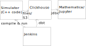

# hammy
Experiments with random walks and pipeline to run them.

## Pipeline

## Results file naming
    <tag>_<experiment_number>_<hypotesis_number>-<implementation_number>_YYYYMMDDHHMMSS_<thread_id>_<chunk_number>

For example:
walk_2_3_1-20220301201003_d670460_1

## Action plan
- [x] Make hello world simulator
- [x] Calculate statistics (# of iterations, run time)
- [x] Save results to file
- [ ] Save results to Clickhouse
- [x] Save statistics to file
- [ ] Save statistics to Clickhouse
